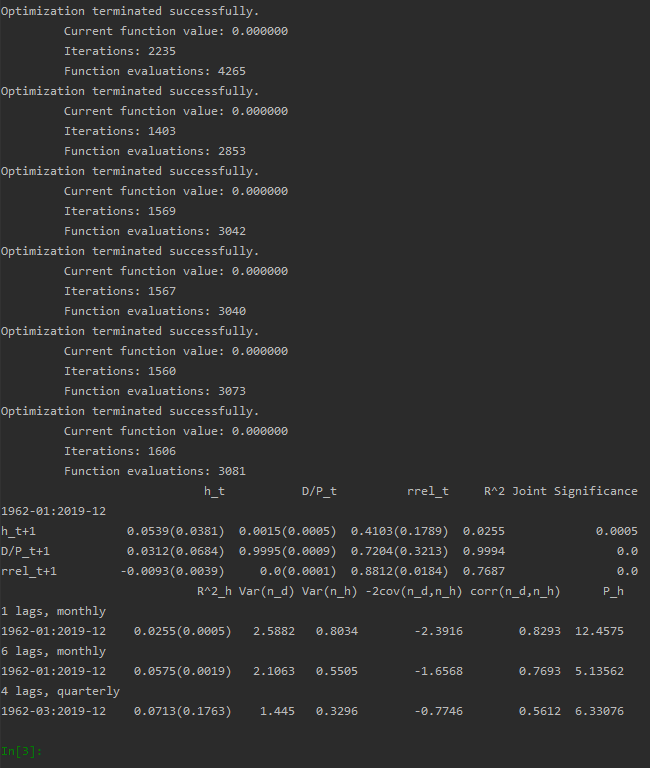

HW1
================
[HW1/main.py](https://github.com/quant-son/EAP-2020/blob/master/HW1/main.py) 실행결과
---------------------------------------------------------------------------------------
  
  

설명
---------------
기간 : 1962-01 ~ 2019-12  
  
사용 데이터 :  
index : log return of CRSP value-weighted index level  
D/P : log(total dividend of NYSE stocks at last year / current market value of NYSE stocks)  
rrel : Fama-Bliss 3-month rate - 12-month moving average of Fama-Bliss 3-month rate  
  
코드 설명 :  
python의 statsmodels를 활용하여 구현하였습니다.  
  
[HW1/main.py](https://github.com/quant-son/EAP-2020/blob/master/HW1/main.py) : 데이터 로드 및 전처리, 테이블 출력 및 csv file로 저장  
[HW1/GMM.py](https://github.com/quant-son/EAP-2020/blob/master/HW1/GMM.py) : GMM 최적화 코드 
[HW1/VAR_GMM.py](https://github.com/quant-son/EAP-2020/blob/master/HW1/VAR_GMM.py) : 기존의 statsmodels의 VAR에서 GMM estimator를 사용할 수 있게 재구성한 클래스  
[HW1/RM.py](https://github.com/quant-son/EAP-2020/blob/master/HW1/RM.py) : Table 1의 joint significance 및 R^2를 계산하기 위한 클래스  
[HW1/get_table.py](https://github.com/quant-son/EAP-2020/blob/master/HW1/get_table.py) : Table 1 및 2를 출력하기 위한 클래스  
  

